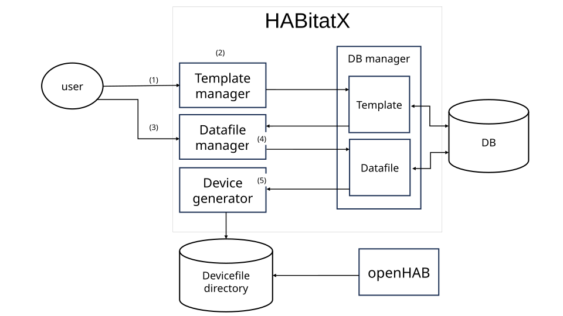
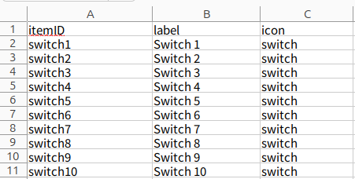

[English][] | [日本語][]


[English]:  https://github.com/nomlab/HABitatX/blob/main/README.md       "English"
[日本語]:    https://github.com/nomlab/HABitatX/blob/main/README.ja.md    "日本語"

# HABitatX
HABitatX は，スマートホームシステムである openHAB では煩雑になりがちな複数デバイスの一括管理を支援するツールである．
本システムは，openHAB の一括管理操作を提供するインターフェースとして動作する．事前に openHAB が動作していることが条件である．
本システムは単体で動作し，openHAB が動作するコンピュータ上で動作している．
本システムは openHAB のデバイス設定を担うテキストファイルを一括で作成，変更，削除できる．

openHAB のデバイス設定を担うテキストファイルはテンプレートコードとスプレッドシートから作成される．
テンプレートコードは，openHAB のデバイスを設定するテキストファイルの構造を定義する．
また，テンプレートコードは埋め込み型であり，外部から取得した情報を指定された箇所に埋め込むことでテキストファイルを作成する．形式としてテンプレートエンジンである ERB を用いる．
スプレッドシートは，テンプレートコードに埋め込まれる情報の一覧を持つインタフェースである．
Excel 形式を用いる．

"HABitatX"は，"openHAB"，"habitat"をもとに作られた造語である．
この名前は，openHAB を表す"HAB"と生息地を表す"habitat"，未来への展望を表す"X"を組み合わせたものである．
# Requirements
+ Ruby 3.3.3
+ Ruby on Rails 7.1.3.4
+ openHAB 3.4.3 ~
  + https://www.openhab.org/
+ RDBMS (Relational Data Base Management System)


# Setup
## HABitatX
1. ダウンロードする
   ```bash
   $ git clone https://github.com/SenoOh/HABitatX.git
   ```
## Install RDBMS
本システムは DB との接続に`ActiveRecord`を使用しているため，任意のリレーショナルデータベース管理システム(`RDBMS`)を使用できる．Docker で動かす際は不要である．今回は例として SQLite3 のインストールについて説明する．
1. aptでインストールする
   ```bash
   $ sudo apt install sqlite3
   ```

# Launch
## 事前準備
1. `.env.example` をコピーして `.env` を作成する
2. `.env` の `OPENHAB_PATH`，`AUTH_SERVER_PATH`，`PUB_KEY` をそれぞれ自身の情報に置き換える
3. 任意の RDBMS の gem について `Gemfile` に追加し，その他 RDBMS の情報を適宜，必要場所に追加，編集する

## Linux
1. `bundle install`する
   ```bash
   $ bundle install
   ```
2. DBを作成する
   ```bash
   $ rails db:migrate
   ```
3. 起動
```bash
$ bin/rails server
```
起動後，ブラウザ上で http://localhost:3000 を開くと HABitatX の画面が開く

## Docker
1. コンテナイメージ作成
```bash
$ ./start.sh
```
起動後，ブラウザ上で http://localhost:3000 を開くと HABitatX の画面が開く

# Usage


## デモ
1. テンプレートコード作成
   ```bash
   Switch <%= code['itemID'] %> "<%= code['label'] %>" <<%= code['icon'] %>>
   ```
2. template操作部でtitle，code，openHAB ID prefix，extensionを設定

   https://www.youtube.com/watch?v=XqZT1b-lbVg

   ・codeはテンプレートコードである
   
   ・openHAB ID prefix と 各デバイスのIDを組み合わせて設定ファイル名を作成する
   
   ・extentionは拡張子を選択する

3. スプレッドシート作成

   

   スプレッドシートは `HABitatX/db/excel` に配置することで使用できる

4. datafile操作部でtitle，spreadsheet，codeを設定

   https://www.youtube.com/watch?v=Kh5YQE_awGI

5. デバイス一括作成

   https://www.youtube.com/watch?v=ZzczEUgfLsQ

デモ動画で使用したテンプレートコードとスプレッドシートは `HABitatX/examples` に配置している