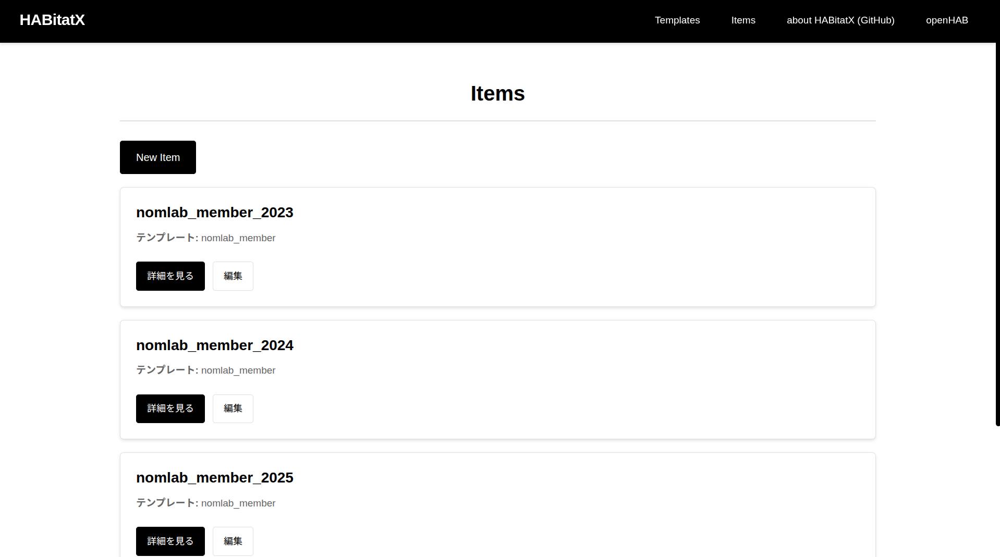
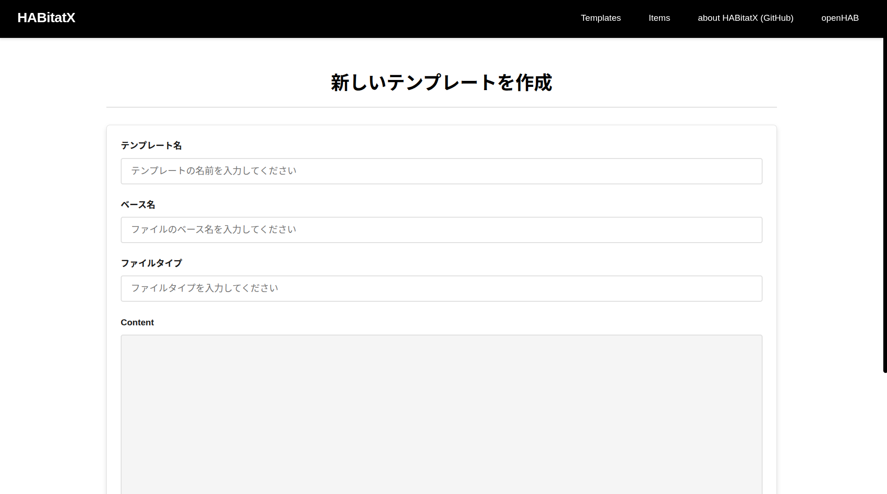
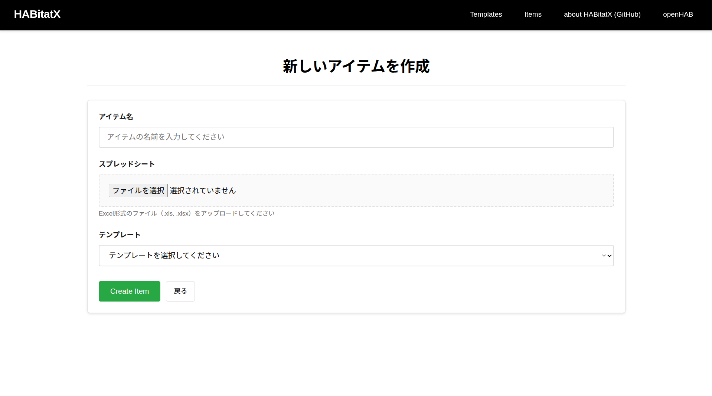

[English][] | [日本語][]


[English]:  https://github.com/nomlab/HABitatX/blob/main/README.md       "English"
[日本語]:    https://github.com/nomlab/HABitatX/blob/main/README.ja.md    "日本語"

# HABitatX
HABitatX is a tool that supports batch management of multiple devices, which tends to be complicated in the openHAB smart home system. 
This system works as an interface to provide batch management operations for openHAB. It is required that openHAB is running. 
The system operates as a stand-alone application and runs on the same computer as openHAB. It can create, modify, and delete text files that configure openHAB devices at once. 

Text files that configure openHAB devices are created from template codes and spreadsheets. 
Template code defines the structure of a text file that configures the openHAB device. 
Template code is an embedded type and creates a text file by embedding information obtained from external sources in specified locations. 
It uses ERB, a template engine, as the format. 
A spreadsheet is an interface that contains a list of information to be embedded in the template code. 
It uses Excel as the format. 

HABitatX" is a term coined from "openHAB", "habitat", and "X" which represents a vision for the future.
# Requirements
+ Ruby 3.3.3
+ Ruby on Rails 7.1.3.4
+ openHAB 3.4.3 ~
  + https://www.openhab.org/
+ RDBMS (Relational Data Base Management System)


# Setup
## HABitatX
1. Clone this repository 
   ```bash
   $ git clone https://github.com/SenoOh/HABitatX.git
   ```
## Install RDBMS
This system uses `ActiveRecord` for DB connection, so it can use relational database management system (`RDBMS`). 
When you use `Docker` to launch HABitatX, you need not to install it. We explain the installation of SQLite3 as an example. 
1. Install SQlite3
   ```bash
   $ sudo apt install sqlite3
   ```


# Launch
## Preliminary Preparations
1. Copy `.env.example` file and create `.env` file.
2. Replace `OPENHAB_PATH` and `OPENHAB_LINK` in the `.env` file with your own information.
3. When using containers, complete the port and UID settings in the `.env` file.
4. For production environment, set `RAILS_ENV` to `production` in the `.env` file and generate `SECRET_KEY_BASE`.

## Docker (Recommended)
1. Build container image
```bash
$ ./start.sh
```
After launching, open http://localhost:9000 in your browser to open the HABitatX screen.
* For production environment, open http://localhost:9100 in your browser after launching.

## Linux
1. bundle install
   ```bash
   $ bundle install
   ```
2. Generate DB
   ```bash
   $ rails db:migrate
   ```
3. Launch
```bash
$ bundle exec rails server
```
After launching, open http://localhost:9000 in your browser to open the HABitatX screen.

# Usage

1. Create template code
   ```ruby
   table.each do |member|
      equipment(name: "#{member[:name]}", label: "#{member[:label]}", icon: "Man_1", parent: "room106") do
         point(name: "#{member[:name]}_position", label: "#{member[:label]} Position", type: "String", icon: "motion", parent: "positions", tags: ["Point", "Presence"])
         point(name: "#{member[:name]}_status", label: "#{member[:label]} Status", type: "String", icon: "status", tags: ["Point", "Presence"])
      end
   end
   ```
2. Set template name, base name, file type, and Content in the template management section

* Code is the template code
* Create configuration DSL name by combining base name and template name
* File type is the extension to select
* Content is the template code created in step 1

3. Create spreadsheet

* See [spreadsheet](https://github.com/nomlab/habdsl?tab=readme-ov-file#spreadsheet) for how to create

4. Set item name, spreadsheet, and template in the item management section


5. Batch create devices