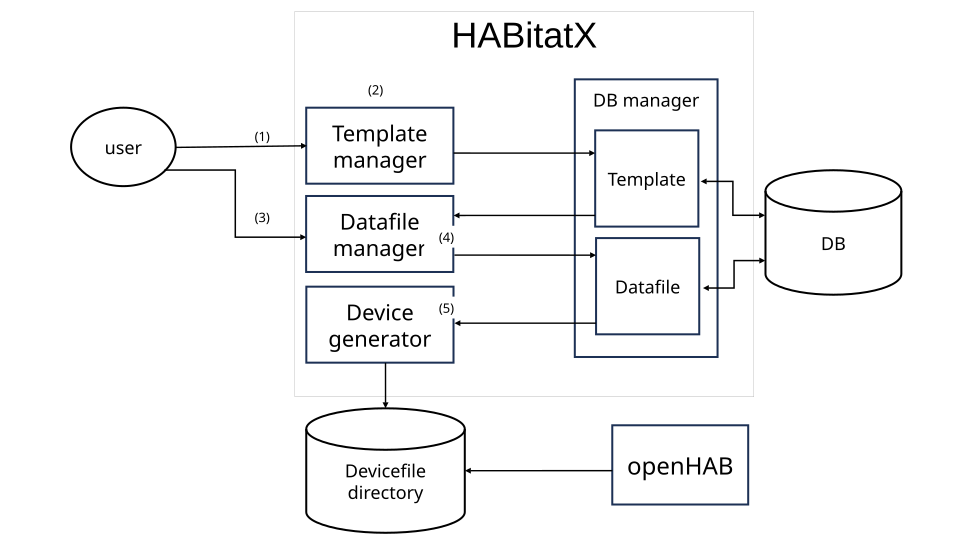
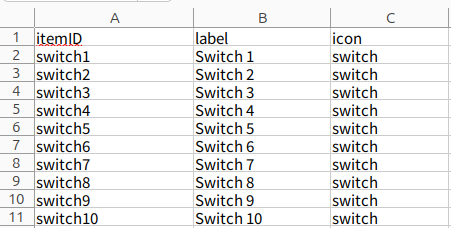

[English][] | [日本語][]


[English]:  https://github.com/nomlab/HABitatX/blob/main/README.md       "English"
[日本語]:    https://github.com/nomlab/HABitatX/blob/main/README.ja.md    "日本語"

# HABitatX
HABitatX is a tool that supports batch management of multiple devices, which tends to be complicated in the openHAB smart home system.
This system works as an interface to provide batch management operations for openHAB. It is required that openHAB is running.
The system operates as a stand-alone application and runs on the same computer as openHAB. It can create, modify, and delete text files that configure openHAB devices at once.

Text files that configure openHAB devices are created from template codes and spreadsheets.
Template code is a code that defines the structure and format of the text file that configures openHAB devices, and can embed necessary information in the specified locations. ERB is used as the format.
A spreadsheet is an interface with information embedded in the template code that is necessary to create a text file.The Excel format is used.

HABitatX" is a term coined from "openHAB," "habitat," and "X," which represents a vision for the future.
# Requirements
+ Ruby 3.x
+ openHAB 3~
  + https://www.openhab.org/
+ RDBMS (Relational Data Base Management System)


# Setup
## HABitatX
1. Clone this repository 
   ```bash
   $ git clone https://github.com/SenoOh/HABitatX.git
   ```
## Install RDBMS
This system uses `ActiveRecord` for DB connection, so any relational database management system (`RDBMS`) can be used. I explain the installation of SQLite3 as an example.
1. Install SQlite3
   ```bash
   $ sudo apt install sqlite3
   ```


# Launch
## Preliminary Preparations
1. Change `OPENHAB_PATH` in `habitatx.rb` to the directory where your openHAB text files are located.
2. Change `ActiveRecord::Base.establish_connection()` to your RDBMS information.
3. Change the RDBMS information in `config/database.yml` to your RDBMS information.
4. Add any RDBMS gem you want to use to `Gemfile` and `habitatx.rb`.
5. bundle install
   ```bash
   $ bundle install
   ```
6. Generate DB
   ```bash
   $ bundle exec rake db:migrate
   ```

## Linux
1. Launch
```bash
$ bundle exec ruby habitatx.rb
```
After launching, open http://localhost:4567 in your browser to open the HABitatX screen.

## Docker
1. Generate Container Image
```bash
$ docker build -t habitatx_docker .
```
2. Launch (If openHAB is not running in a container)
```shell
$ docker run -it -p 4567:4567 --name habitatx -v ${PWD}/:/var/www habitatx_docker
```
3. Launch (If openHAB is running in a container)
```shell
$ docker run -it -p 4567:4567 --name habitatx -v ${PWD}/:/var/www --volumes-from <openHABのコンテナ名> habitatx_docker
```
After launching, open http://localhost:4567 in your browser to open the HABitatX screen

# Usage


## Demo movie
1. Generate template code.
   ```bash
   Switch <%= code['itemID'] %> "<%= code['label'] %>" <<%= code['icon'] %>>
   ```
2. Set title, code, openHAB ID prefix, and extension in the template operator.

   https://www.youtube.com/watch?v=XqZT1b-lbVg

   ・code is template code.
   
   ・Create a text file name by combining openHAB ID prefix and the ID of each device.
   
   ・For "extension", select the extension from the pull-down menu.

3. Generate spreadsheet.

   

   Spreadsheets can be used by placing them in `HABitatX/db/excel`.

4. Set title，spreadsheet and code in the datafile operator.

   https://www.youtube.com/watch?v=Kh5YQE_awGI

5. Generate devices at once.

   https://www.youtube.com/watch?v=ZzczEUgfLsQ

The template code and spreadsheets used in the demo video are placed in `HABitatX/examples`.