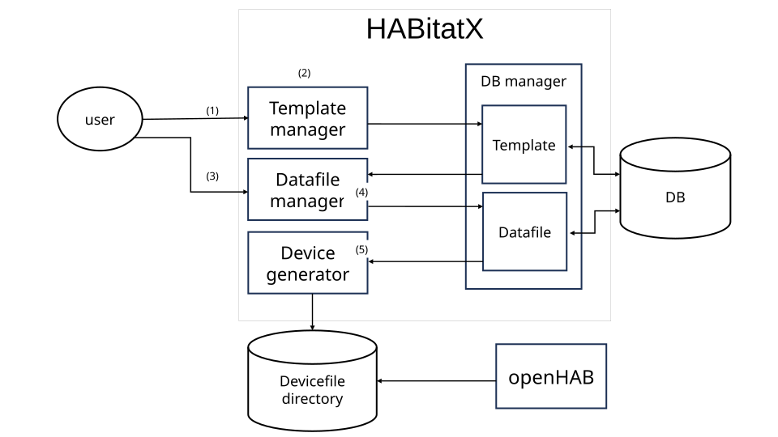

[English][] | [日本語][]


[English]:  https://github.com/nomlab/HABitatX/blob/main/README.md       "English"
[日本語]:    https://github.com/nomlab/HABitatX/blob/main/README.ja.md    "日本語"

# HABitatX
HABitatX is a tool that supports batch management of multiple devices, which tends to be complicated in the openHAB smart home system. 
This system works as an interface to provide batch management operations for openHAB. It is required that openHAB is running. 
The system operates as a stand-alone application and runs on the same computer as openHAB. It can create, modify, and delete text files that configure openHAB devices at once. 

Text files that configure openHAB devices are created from template codes and spreadsheets. 
Template code defines the structure of a text file that configures the openHAB device. 
Template code is an embedded type and creates a text file by embedding information obtained from external sources in specified locations. 
It uses ERB, a template engine, as the format. 
A spreadsheet is an interface that contains a list of information to be embedded in the template code. 
It uses Excel as the format. 

HABitatX" is a term coined from "openHAB", "habitat", and "X" which represents a vision for the future.
# Requirements
+ Ruby 3.3.3
+ Ruby on Rails 7.1.3.4
+ openHAB 3.4.3 ~
  + https://www.openhab.org/
+ RDBMS (Relational Data Base Management System)


# Setup
## HABitatX
1. Clone this repository 
   ```bash
   $ git clone https://github.com/SenoOh/HABitatX.git
   ```
## Install RDBMS
This system uses `ActiveRecord` for DB connection, so it can use relational database management system (`RDBMS`). 
When you use `Docker` to launch HABitatX, you need not to install it. We explain the installation of SQLite3 as an example. 
1. Install SQlite3
   ```bash
   $ sudo apt install sqlite3
   ```


# Launch
## Preliminary Preparations
1. Copy `.env.example` file and create `.env` file.
2. Replace  `OPENHAB_PATH`，`AUTH_SERVER_PATH` and `PUB_KEY` in the `.env` file with your own information. 
3. Add any RDBMS gem to the `Gemfile`, and add or edit other RDBMS information as needed.

## Linux
1. bundle install
   ```bash
   $ bundle install
   ```
2. Generate DB
   ```bash
   $ rails db:migrate
   ```
3. Launch
```bash
$ bin/rails server
```
After launching, open http://localhost:3000 in your browser to open the HABitatX screen.

## Docker
1. Launch
```bash
$ ./start.sh
```
After launching, open http://localhost:3000 in your browser to open the HABitatX screen.

# Usage


## Demo movie
1. Generate template code.
   ```bash
   Switch <%= code['itemID'] %> "<%= code['label'] %>" <<%= code['icon'] %>>
   ```
2. Set title, code, openHAB ID prefix, and extension in the template operator.

   https://www.youtube.com/watch?v=XqZT1b-lbVg

   ・code is template code.
   
   ・Create a text file name by combining openHAB ID prefix and the ID of each device.
   
   ・For "extension", select the extension from the pull-down menu.

3. Generate spreadsheet.

   

   Spreadsheets can be used by placing them in `HABitatX/db/excel`.

4. Set title，spreadsheet and code in the datafile operator.

   https://www.youtube.com/watch?v=Kh5YQE_awGI

5. Generate devices at once.

   https://www.youtube.com/watch?v=ZzczEUgfLsQ

The template code and spreadsheets used in the demo video are placed in `HABitatX/examples`.